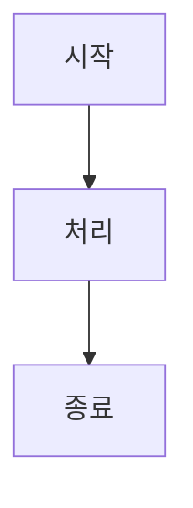
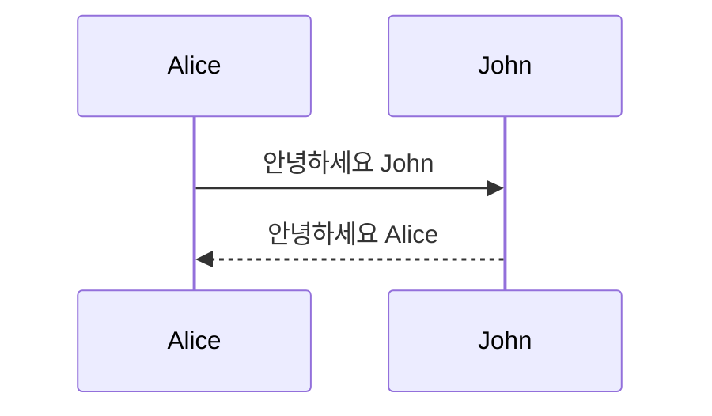

# 제목 1
## 제목 2
### 제목 3
#### 제목 4
##### 제목 5
###### 제목 6

*이탤릭체*
_이탤릭체_

**볼드체**
__볼드체__

**_이탤릭체와 볼드체_**
***이탤릭체와 볼드체***

~~취소선~~

1. 첫 번째 항목
2. 두 번째 항목
3. 세 번째 항목
   1. 들여쓰기된 항목
   2. 들여쓰기된 항목

- 항목 1
- 항목 2
- 항목 3
  - 중첩 항목
  - 중첩 항목

* 항목 1
* 항목 2

+ 항목 1
+ 항목 2

[링크 텍스트](https://www.example.com)

[링크 텍스트](https://www.example.com "링크 설명(마우스 오버시 표시)")

[참조 링크][1]

[1]: https://www.example.com "참조 링크 설명"

<https://www.example.com> (자동 링크)

[문서 내 링크](#제목-표시줄의-이름)


[](https://www.example.com)

[참조 이미지][img1]

[img1]: 이미지_url.jpg "참조 이미지 설명"

`인라인 코드` 사용 예시

인라인 수식: $E=mc^2$

블록 수식:
$$
\frac{d}{dx}e^x = e^x
$$

```
여러 줄 코드 블록
줄 1
줄 2
줄 3
```

```javascript
// 언어 지정 코드 블록
function sayHello() {
  console.log("Hello, World!");
}
```

```python
# 파이썬 코드 예시
def hello_world():
    print("Hello, World!")
```

| 제목 1 | 제목 2 | 제목 3 |
|--------|--------|--------|
| 내용 1 | 내용 2 | 내용 3 |
| 내용 4 | 내용 5 | 내용 6 |

| 왼쪽 정렬 | 가운데 정렬 | 오른쪽 정렬 |
|:---------|:----------:|-----------:|
| 내용 1    | 내용 2     | 내용 3     |
| 내용 4    | 내용 5     | 내용 6     |

> 인용문 첫 번째 줄
> 인용문 두 번째 줄
>
> 인용문 내 단락 나눔

> 첫 번째 수준 인용문
>> 두 번째 수준 인용문
>>> 세 번째 수준 인용문

---

***

___

첫 번째 줄  
두 번째 줄 (끝에 공백 2개)

첫 번째 줄<br>
두 번째 줄 (HTML 태그 사용)

- [x] 완료된 작업
- [ ] 미완료된 작업
- [ ] ~~취소된 작업~~

각주가 있는 텍스트[^1]

[^1]: 각주 내용

:smile: :heart: :thumbsup:

GitHub에서 지원하는 이모지 코드:
:+1: :sparkles: :camel: :tada:
:rocket: :metal: :octocat:

<div align="center">
  <h1>HTML 태그를 사용한 가운데 정렬</h1>
  <p>마크다운 내에서 HTML 사용이 가능합니다.</p>
</div>

<details>
  <summary>접기/펼치기 버튼</summary>
  
  여기에 숨겨진 내용이 들어갑니다.
  마크다운 문법도 사용 가능합니다.
  
  - 목록 1
  - 목록 2
</details>

<kbd>Ctrl</kbd>+<kbd>C</kbd> 단축키 표시

> **Note**
> 이것은 노트 형식의 강조 박스입니다.

> **Warning**
> 이것은 경고 형식의 강조 박스입니다.

[TOC]

또는

- [목차](#목차)
  - [제목1](#제목1)
  - [제목2](#제목2)




